# Tarea 6 

###### Jorge Jankovich Ramos - 2021

#### Cread un directorio Tarea6-GIT dentro de vuestro repositorio de Entornos. O si no lo tenéis, como repositorio local.

#### 0. Importar el proyecto en vuestro WorkSpace de Eclipse.
 

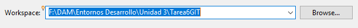

#### 1. Cread un fichero test.java con la clase test como sigue:
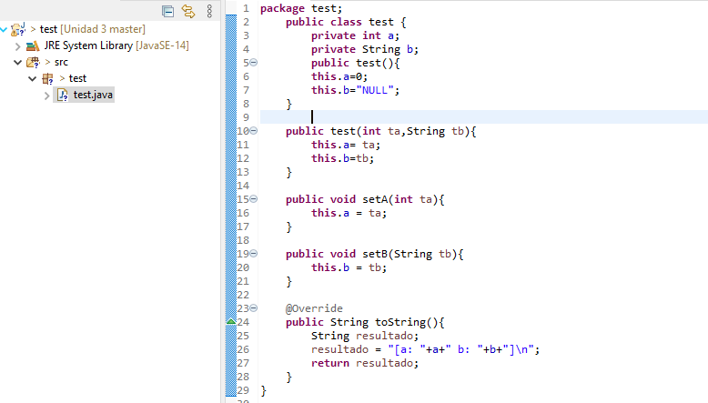
 
#### 2. Pasad a preparado el fichero. 
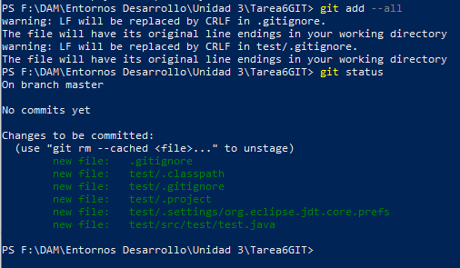
 
#### 3. Cread el fichero Principal.java
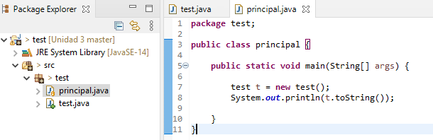

#### 4. Pasad a preparado el fichero
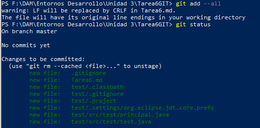

#### 5. Haced un commit con el comentario “Inicial clases test y principal”
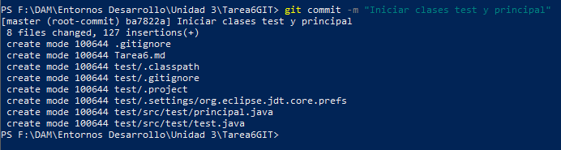

#### 6. Comprobad la salida del programa. (debéis compilar los .java y probar el Principal)
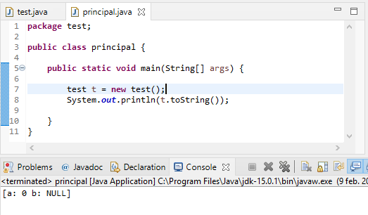

#### 7. Modificad el fichero test eliminando el método toString()
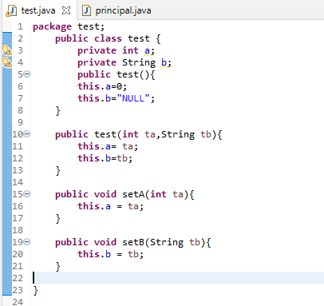

#### 8. Pasad a preparado el fichero

#### 9. Realizad un segundo commit “Eliminada ToString()”
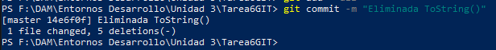

#### 10. Comprobad de nuevo la salida del programa.

#### 11. Volved atrás viendo los “log” y haciendo “checkout” necesarios para que la salida del programa sea la del paso 6. Responded a las preguntas en el markdown: ¿Qué creéis que hace el método toString? Y ¿Qué conseguimos con el @Override?
 
 Hay dos commit porque en el primero eliminé ToString() pero no @Override.
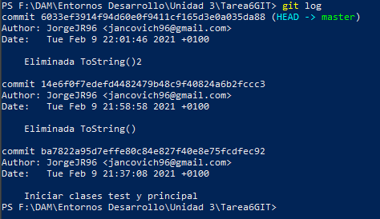

Volviendo a la primera versión
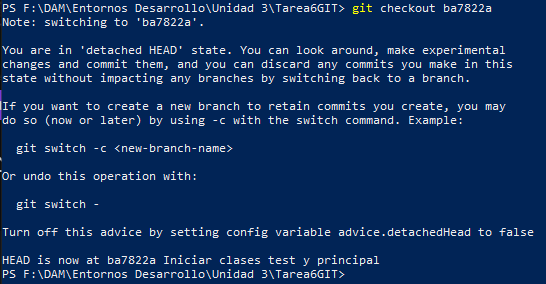

Imprime un String que muestra el valor de a y b. @Override indica al compilador que estamos sobrescribiendo un método.